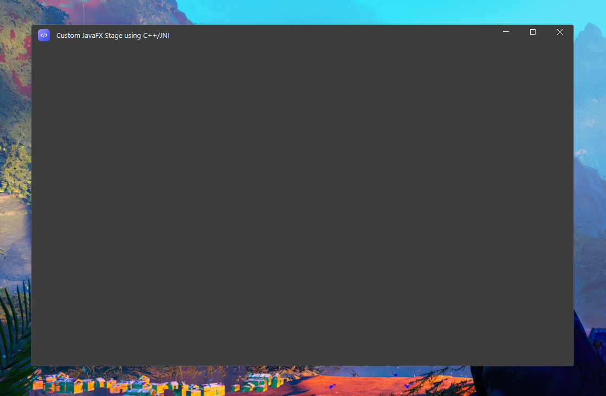
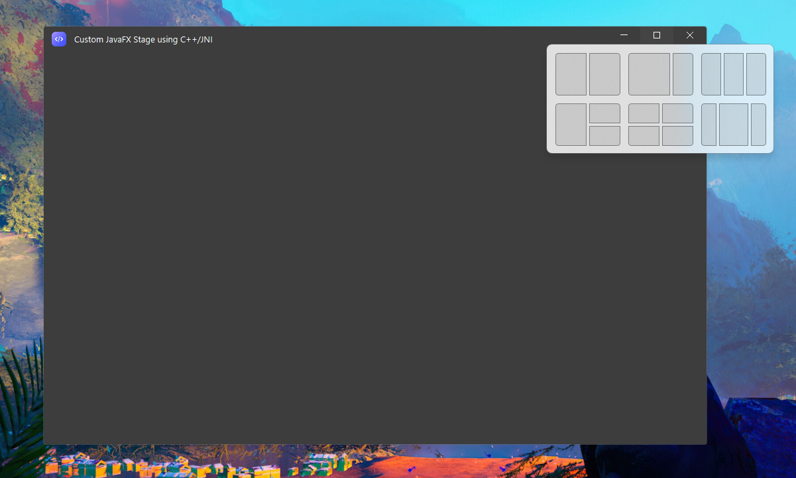
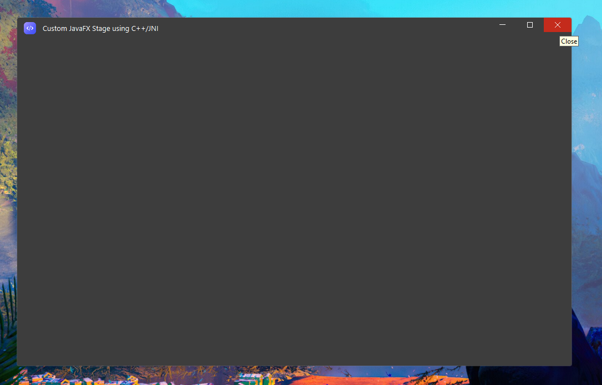
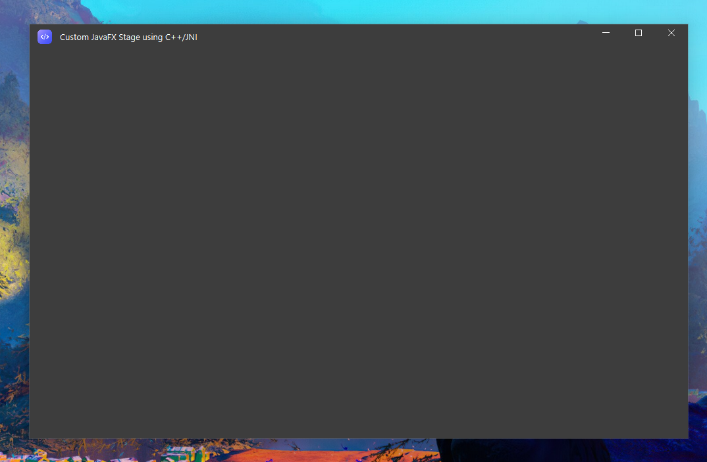

## fx-jni Demo
***
This is a demo application showcasing the usage of the "fx-jni" library,
which allows custom window styles when using Javafx on Windows.

## Overview

The "fx-jni" library facilitates the interaction between JavaFX 
applications and native code, making it possible to leverage
native capabilities within a JavaFX application, like custom window styles,
creating custom themes, etc.
This demo serves as a simple example to demonstrate the library's capabilities.

***

### Features

* Native behaviour & native tooltips.
* Ability to set custom Stage styles.
* Ability to 100% integrate themes, not only for the javafx nodes, also for the Stage itself.
* Show/Hide Stage from the TaskBar.
* Set Stage corner's preferences.
* The Decoration implementation introduces a new way to handle window states(Minimized/Normal/Maximized).
* Ability to set a visibility delay before showing the Stage.
* An easy way to set you own custom HitTestSpots, very util for adding controls in the window's non client area.
* Very low memory usage.

***

### Screenshots

1. Custom dark Stage (You can create your own Themes).

##
2. Windows 11 Snap layout on maximize button hover.

##
3. Native Tooltips.

##
4. Custom corner preference (No rounded corners).

***

## fx-jni License

The "fx-jni" library is provided under the following terms:

1. The library is distributed under the MIT License.
2. The library is provided "as is," without any warranties or guarantees of any kind.
3. The developer(s) and contributors to this library are not responsible for any damages or losses resulting from the use or misuse of this library.
4. Users are encouraged to use this library responsibly and at their own risk.

